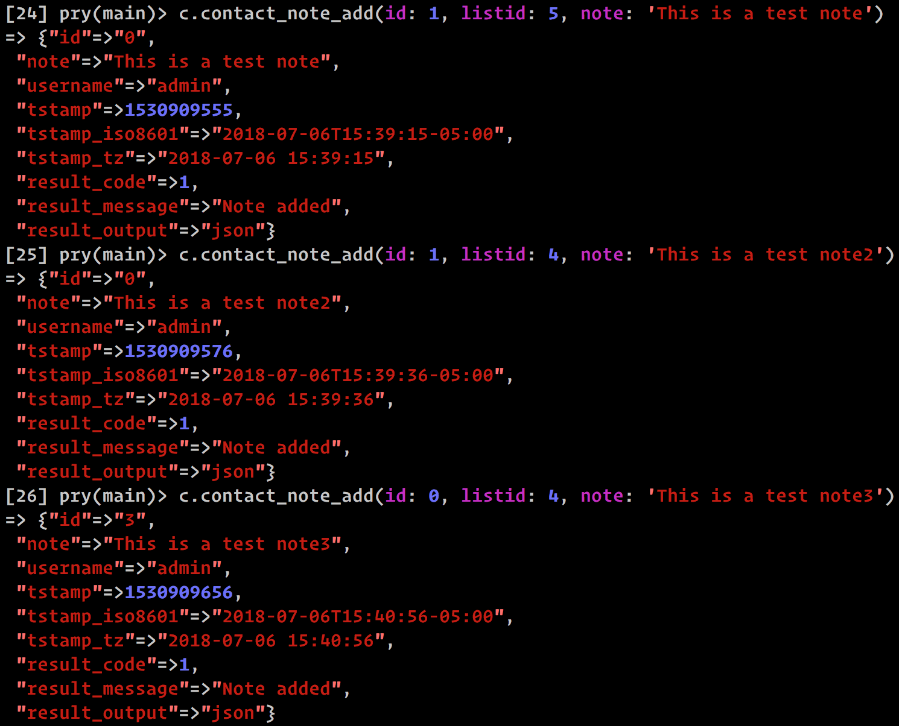
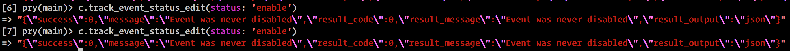
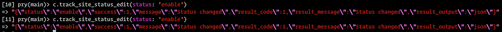

# ActiveCampaign API Doc bugs & gotchas

## V2

### Address
- _address_add_ - Says it requires `addr_1` parameter, but this parameter is actually `address_1`. I haven't tested it, but I would guess `addr_2` that's mentioned in the docs is actually `address_2`.

### List
- _list_field_view_ - Couldn't ever get this to work
- _list_add_ - `sender_name`, `sender_addr1`, `sender_zip`, `sender_city`, `sender_country`, `sender_url`, and `sender_reminder` appear to all be required, however the docs only say that from that list only `sender_addr1` and `sender_country` are required.

### Group
- _group_list_ - Requires a comma-separated list of group **ids**, but I can't find any way to view what these ids are in the UI. Other _*\_list_ endpoints allow "all" to be passed in for `ids`, to display all of them. This however does not appear to work for Groups.

### Contact
- _contact_add_ - says `p` is a required parameter, but it is not. It is required for _contact_edit_ however.
- _contact_edit_ - says `email` is required, but it is not.
- _contact_note_add_ - There seems to be something wrong with this endpoint. It sometimes returns `id: 0` for the note that was added, but when you try to delete note 0, it says that it doesn't exist. I haven't figured out a pattern. At first, I thought it was returning `id: 0` for the first note of any `[:id, :listid]` tuple, but after further testing that doesn't appear to be the case
  
  
### Site & Event Tracking
- _track_site_code_ - **Description** says one endpoint URL, **Endpoint** says another, but neither of those appears to work. Through trial and error I came across the following URL, which appears to work, but which I have not found documented anywhere: https://{ACCOUNT}.api-us1.com/api/2/track/site/code
- _track_event_add_ - It says that I can pass the parameters `event`, `eventdata`, and `visit`. When I include `eventdata` & `visit` though, I get a success response, but the event doesn't appear to be available in the UI.
  - Also, it would be nice if there were one place in the UI to see all events that have posted to our account, with the values for `eventdata` & `visit` that was posted with the event.
    - To my knowledge, I haven't been able to successfully post `eventdata` & `visit` with an event, even though I get a success response. A place to view all events with this data would allow me to confirm that it's there.
    - If this data isn't available in the UI, what's the point in trying to post the data anyway?
    - Is the only way to tie an event to a user through `email`, inside the `visit` param?
- _track_event_status_edit_ vs _track_site_status_edit_ - For _track_event_status_edit_, if you try to set the status to what it's already set to (enable when already enabled, or disable when already disabled), you get an error. If you do the same for _track_site_status_edit_, you get success.
  
  
  
## V3

### Site & Event Tracking
#### Site Tracking
- _Retrieve site tracking code_ - Says the endpoint is `https://:account.api-us1.com/api/3/track/site/code`, but this does not work. This appears to work though: `https://:account.api-us1.com/api/3/siteTracking/code`

### Deep Data Integrations
#### E-Commerce Customers
- _Create a customer_ - appears to create two customers each time. One with the correct `connectionid` & `externalid` and one where both of those values are set to 0.
